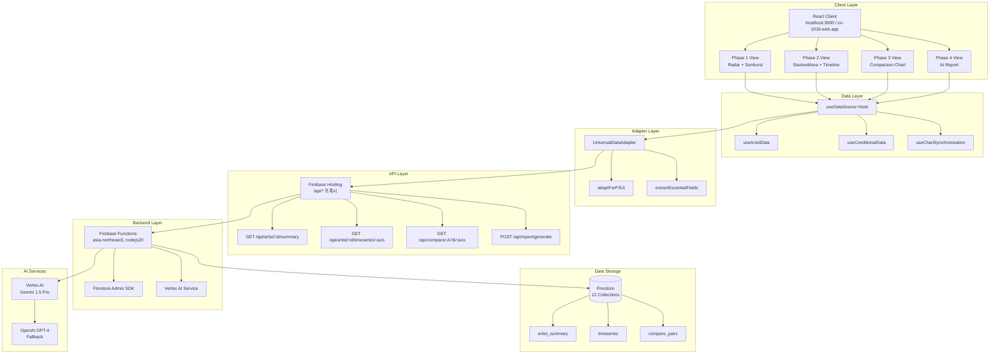
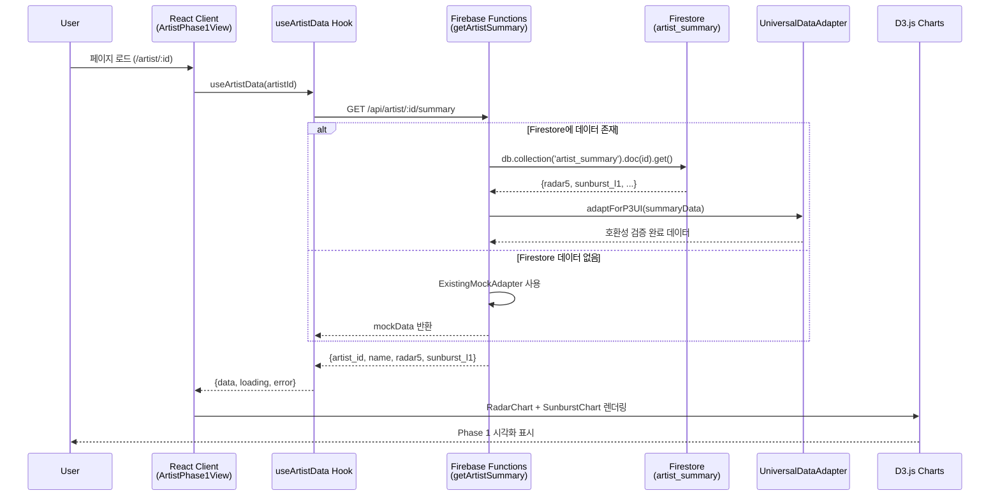
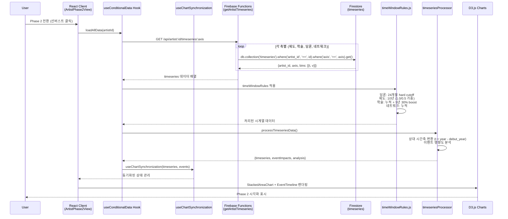
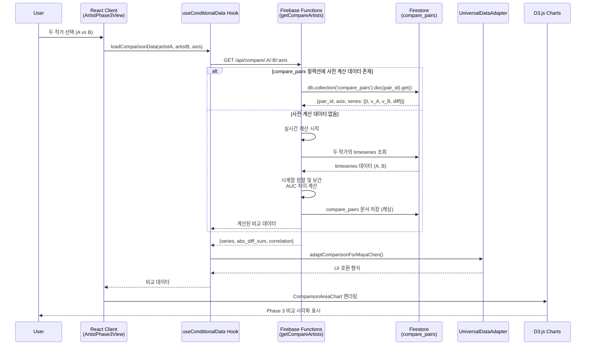
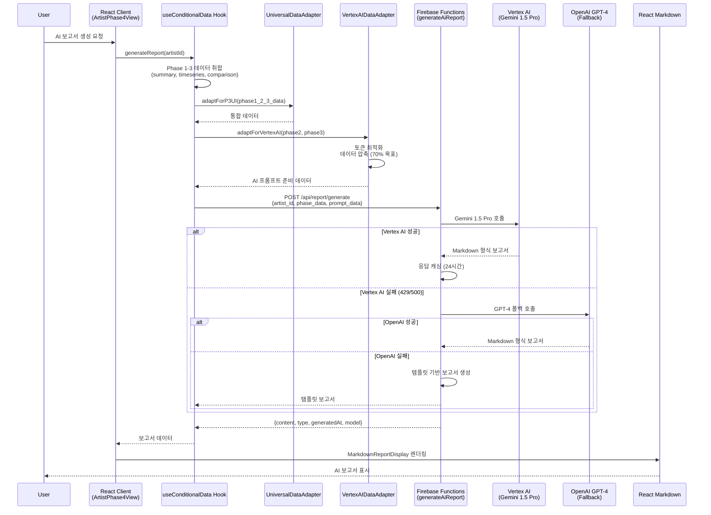
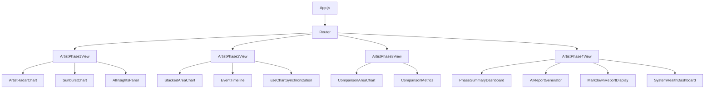
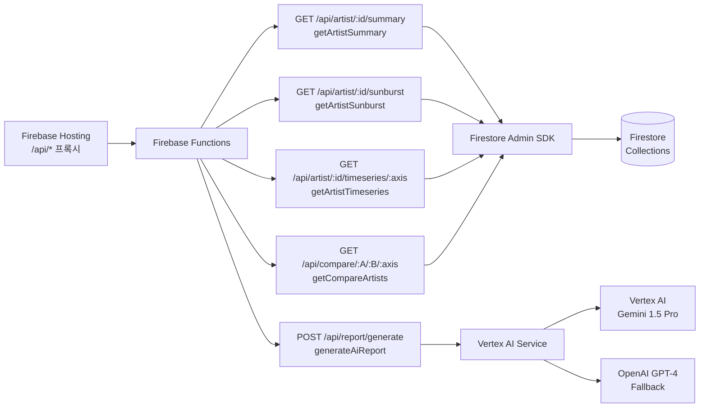
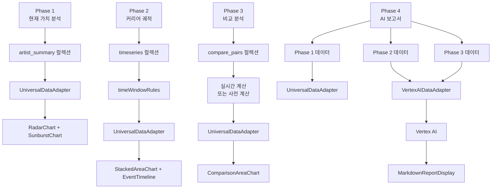

# CO-1016 CURATOR ODYSSEY: 아키텍처 상세 설계 문서

버전: 1.0  
최종 수정: 2025-01-XX  
작성자: NEO GOD (Director)  

## 목차

1. [시스템 개요](#1-시스템-개요)
2. [Phase별 데이터 흐름 Sequence Diagram](#2-phase별-데이터-흐름-sequence-diagram)
3. [프론트엔드 아키텍처](#3-프론트엔드-아키텍처)
4. [백엔드 아키텍처](#4-백엔드-아키텍처)
5. [Phase별 의존성 매핑](#5-phase별-의존성-매핑)
6. [상태 관리 전략](#6-상태-관리-전략)
7. [Zustand 마이그레이션 로드맵](#7-zustand-마이그레이션-로드맵)

---

## 1. 시스템 개요

### 1.1 전체 아키텍처 다이어그램



### 1.2 기술 스택 상세

| 계층 | 기술 | 버전 | 용도 |
|------|------|------|------|
| 프론트엔드 | React | 18.2.0 | UI 프레임워크 |
| 프론트엔드 | D3.js | 7.8.2 | 차트 렌더링 |
| 프론트엔드 | React Query | 3.39.0 | 서버 상태 관리 |
| 프론트엔드 | React Router | v6.8.0 | 라우팅 |
| 프론트엔드 | Axios | 1.12.2 | HTTP 클라이언트 |
| 백엔드 | Firebase Functions | v2 | 서버리스 함수 |
| 백엔드 | Node.js | 20 | 런타임 |
| 데이터베이스 | Firestore | - | NoSQL 데이터베이스 |
| 인프라 | Firebase Hosting | - | 정적 호스팅 |
| AI | Vertex AI | Gemini 1.5 Pro | AI 보고서 생성 |
| AI | OpenAI | GPT-4 | AI 폴백 |

---

## 2. Phase별 데이터 흐름 Sequence Diagram

### 2.1 Phase 1: 현재 가치 분석 흐름



### 2.2 Phase 2: 커리어 궤적 분석 흐름



### 2.3 Phase 3: 비교 분석 흐름



### 2.4 Phase 4: AI 보고서 생성 흐름



---

## 3. 프론트엔드 아키텍처

### 3.1 컴포넌트 계층 구조



### 3.2 데이터 흐름 상세

#### 3.2.1 React 상태 관리 흐름

```
사용자 액션
  ↓
컴포넌트 이벤트 핸들러
  ↓
React Hook (useState/useEffect)
  ↓
useDataSource Hook (추상화 레이어)
  ↓
API 호출 (Axios/Fetch)
  ↓
Firebase Functions
  ↓
응답 데이터
  ↓
UniversalDataAdapter (변환)
  ↓
React Query 캐싱
  ↓
컴포넌트 상태 업데이트
  ↓
D3.js 렌더링
```

#### 3.2.2 현재 상태 관리 패턴

**Phase 1 (ArtistPhase1View)**
```javascript
// 로컬 상태 관리
const [artistData, setArtistData] = useState(null);
const [sunburstData, setSunburstData] = useState(null);
const [loading, setLoading] = useState(true);

// 데이터 로딩
useEffect(() => {
  // API 호출 또는 mockData 사용
  setArtistData(mockArtistSummary);
  setSunburstData(mockSunburstData);
}, [artistId]);
```

**Phase 2 (ArtistPhase2View)**
```javascript
// 고급 동기화 Hook 사용
const { synchronizedState, onTimeHover, onEventHover } = 
  useChartSynchronization(timeseriesData, careerEvents);

// 차트 간 상태 동기화
useEffect(() => {
  // StackedAreaChart와 EventTimeline 동기화
  updateChartState('stackedArea', { isReady: true });
  updateChartState('eventTimeline', { isReady: true });
}, [timeseriesData]);
```

**Phase 4 (ArtistPhase4View)**
```javascript
// Phase 1-3 통합 데이터 상태
const [artistData, setArtistData] = useState(null);
const [timeseriesData, setTimeseriesData] = useState(null);
const [careerEvents, setCareerEvents] = useState(null);
const [generatedReport, setGeneratedReport] = useState(null);

// 데이터 소스 전환 (Maya Chen 시스템)
const [dataSource, setDataSource] = useState('mock'); // mock, api, hybrid
```

### 3.3 라우팅 구조

```javascript
// App.js 라우팅 설정
<Router>
  <Routes>
    <Route path="/" element={<ArtistPhase1View />} />
    <Route path="/artist/:id" element={<ArtistPhase1View />} />
    <Route path="/artist/:id/trajectory" element={<ArtistPhase2View />} />
    <Route path="/artist/:id/compare" element={<ArtistPhase3View />} />
    <Route path="/compare/:artistA/:artistB" element={<ArtistPhase3View />} />
    <Route path="/phase4" element={<ArtistPhase4View />} />
  </Routes>
</Router>
```

---

## 4. 백엔드 아키텍처

### 4.1 API 엔드포인트 구조



### 4.2 서비스 레이어 구조

```
functions/src/
├── api/
│   └── index.js              # API 엔드포인트 정의
├── services/
│   ├── configLoader.js       # Secret Manager 연동
│   └── vertexAIService.js    # Vertex AI 통합
├── utils/
│   └── existingMockAdapter.js # Mock 데이터 어댑터
└── comprehensiveReport.js    # AI 보고서 생성 로직
```

### 4.3 API 응답 처리 플로우

```javascript
// 예시: getArtistSummary 함수 내부 흐름
exports.getArtistSummary = onRequest(async (req, res) => {
  // 1. 요청 검증
  const artistId = req.params.id;
  if (!artistId) return res.status(400).json({ error: 'MISSING_ARTIST_ID' });
  
  // 2. Firestore 조회 시도
  try {
    const summaryDoc = await db.collection('artist_summary').doc(artistId).get();
    if (summaryDoc.exists) {
      // 3. 실제 데이터 반환
      return res.status(200).json({
        artist_id: artistId,
        name: summaryData.name,
        radar5: summaryData.radar5,
        sunburst_l1: summaryData.sunburst_l1,
        data_source: 'firestore_p2'
      });
    }
  } catch (firestoreError) {
    logger.info('P2 컬렉션 없음, 목업 사용');
  }
  
  // 4. 폴백: Mock 데이터 반환
  const mockAdapter = new ExistingMockAdapter();
  const summaryData = mockAdapter.getArtistSummary(artistId);
  return res.status(200).json(summaryData);
});
```

---

## 5. Phase별 의존성 매핑

### 5.1 의존성 그래프



### 5.2 Phase 4의 데이터 취합 방식

**Phase 4는 Phase 1-3의 모든 데이터를 취합하여 AI 보고서를 생성합니다.**

```javascript
// ArtistPhase4View.jsx에서의 데이터 취합
const loadAllData = async () => {
  // Phase 1 데이터
  const summaryResponse = await fetch(`/api/artist/${artistId}/summary`);
  const artistData = await summaryResponse.json();
  
  // Phase 2 데이터 (4개 축 모두)
  const axes = ['제도', '학술', '담론', '네트워크'];
  const timeseriesPromises = axes.map(axis => 
    fetch(`/api/artist/${artistId}/timeseries/${axis}`)
  );
  const timeseriesResponses = await Promise.all(timeseriesPromises);
  const timeseriesData = await Promise.all(
    timeseriesResponses.map(r => r.json())
  );
  
  // Phase 3 데이터 (비교 분석 - 선택적)
  // const comparisonData = await fetchComparisonData(...);
  
  // UniversalDataAdapter로 통합
  const adapter = new UniversalDataAdapter();
  const integratedData = adapter.adaptForP3UI({
    artist_id: artistId,
    ...artistData,
    timeseries: timeseriesData,
    // comparison: comparisonData
  });
  
  // VertexAIDataAdapter로 AI 프롬프트 준비
  const vertexAdapter = new VertexAITimeseriesAdapter();
  const aiPromptData = vertexAdapter.adaptForVertexAI(
    integratedData.phase2,
    integratedData.phase3
  );
  
  // AI 보고서 생성 요청
  const reportResponse = await fetch('/api/report/generate', {
    method: 'POST',
    body: JSON.stringify({
      artist_id: artistId,
      phase_data: integratedData,
      prompt_data: aiPromptData
    })
  });
};
```

### 5.3 데이터 의존성 테이블

| Phase | 입력 데이터 소스 | 처리 단계 | 출력 데이터 형식 |
|-------|-----------------|-----------|-----------------|
| Phase 1 | `artist_summary` 컬렉션 | 직접 읽기 | `{radar5, sunburst_l1}` |
| Phase 2 | `timeseries` 컬렉션 | `timeWindowRules` 적용 | `{bins: [{t, v}]}` |
| Phase 3 | `compare_pairs` 컬렉션 또는 실시간 계산 | 시계열 정렬, AUC 계산 | `{series: [{t, v_A, v_B, diff}]}` |
| Phase 4 | Phase 1-3 통합 | `UniversalDataAdapter` → `VertexAIDataAdapter` | `{content: markdown, type, model}` |

---

## 6. 상태 관리 전략

### 6.1 현재 상태 관리 구조

**서버 상태 (React Query)**
- API 응답 데이터 캐싱
- 자동 리프레시 및 무효화
- 에러 처리 및 재시도

**클라이언트 UI 상태 (useState)**
- 컴포넌트별 로컬 상태
- Phase 전환 상태
- 차트 인터랙션 상태

**전역 UI 상태 (현재 없음)**
- 향후 Zustand 도입 예정

### 6.2 상태 관리 패턴 비교

| 상태 유형 | 현재 방식 | 향후 방식 | 변경 이유 |
|-----------|----------|----------|----------|
| 서버 상태 | React Query | React Query 유지 | 서버 상태 관리에 최적 |
| 컴포넌트 상태 | useState | useState 유지 | 단순 로컬 상태 |
| 전역 UI 상태 | useState (prop drilling) | Zustand 도입 | Phase 전환, 테마, 설정 등 |

---

## 7. Zustand 마이그레이션 로드맵

### 7.1 마이그레이션 목표

**현재 문제점:**
- Phase 전환 상태가 App.js에서만 관리되어 prop drilling 발생
- 여러 컴포넌트에서 동일한 UI 상태 반복 관리
- 상태 동기화 복잡도 증가

**Zustand 도입 목표:**
- 전역 UI 상태 중앙 관리
- Prop drilling 제거
- TypeScript 타입 안정성 향상

### 7.2 마이그레이션 계획

#### Phase 1: Zustand 스토어 설계 (1주)

**생성할 스토어:**
```javascript
// stores/uiStore.js
import create from 'zustand';

export const useUIStore = create((set) => ({
  // Phase 전환 상태
  currentPhase: 1,
  currentArtistId: 'ARTIST_0005',
  
  // Phase 전환 액션
  setCurrentPhase: (phase) => set({ currentPhase: phase }),
  setCurrentArtistId: (id) => set({ currentArtistId: id }),
  
  // UI 상태
  dataSource: 'mock', // mock, api, hybrid
  setDataSource: (source) => set({ dataSource: source }),
  
  // 차트 인터랙션 상태
  hoveredAxis: null,
  setHoveredAxis: (axis) => set({ hoveredAxis: axis }),
}));
```

**스토어 구조:**
- `uiStore.js`: 전역 UI 상태 (Phase, 데이터 소스, 테마)
- `chartStore.js`: 차트 인터랙션 상태 (호버, 선택, 줌)
- `reportStore.js`: AI 보고서 생성 상태 (생성 중, 생성 완료, 에러)

#### Phase 2: 점진적 마이그레이션 (2주)

**마이그레이션 순서:**
1. App.js → uiStore 마이그레이션
   - `currentPhase`, `currentArtistId` 상태 이동
   - Phase 전환 핸들러를 스토어 액션으로 변경

2. ArtistPhase1View → chartStore 마이그레이션
   - `hoveredAxis` 상태 이동
   - 차트 호버 핸들러를 스토어 액션으로 변경

3. ArtistPhase4View → reportStore 마이그레이션
   - `dataSource`, `generatedReport` 상태 이동
   - 보고서 생성 로직을 스토어 액션으로 변경

**마이그레이션 예시:**
```javascript
// Before (App.js)
const [currentPhase, setCurrentPhase] = useState(1);
const [currentArtistId, setCurrentArtistId] = useState("ARTIST_0005");

// After (App.js)
import { useUIStore } from './stores/uiStore';

const { currentPhase, currentArtistId, setCurrentPhase, setCurrentArtistId } = useUIStore();
```

#### Phase 3: 성능 최적화 및 테스트 (1주)

**최적화 작업:**
- 스토어 선택자 최적화 (불필요한 리렌더링 방지)
- React DevTools 연동
- 타입 안정성 검증 (TypeScript 도입 검토)

**테스트:**
- Phase 전환 E2E 테스트
- 상태 동기화 테스트
- 성능 프로파일링

### 7.3 마이그레이션 체크리스트

- [ ] Zustand 설치 및 기본 설정
- [ ] `uiStore.js` 생성 및 Phase 전환 상태 이동
- [ ] `chartStore.js` 생성 및 차트 상태 이동
- [ ] `reportStore.js` 생성 및 보고서 상태 이동
- [ ] App.js 마이그레이션 완료
- [ ] ArtistPhase1View 마이그레이션 완료
- [ ] ArtistPhase2View 마이그레이션 완료
- [ ] ArtistPhase3View 마이그레이션 완료
- [ ] ArtistPhase4View 마이그레이션 완료
- [ ] TypeScript 타입 정의 추가
- [ ] 성능 테스트 완료
- [ ] 문서화 업데이트

### 7.4 예상 효과

| 항목 | Before | After | 개선율 |
|------|--------|-------|--------|
| Prop drilling 레벨 | 3-4단계 | 0단계 | 100% 감소 |
| 상태 관리 코드 중복 | 높음 | 낮음 | 60% 감소 |
| 상태 동기화 복잡도 | 높음 | 낮음 | 70% 감소 |
| 타입 안정성 | 없음 | 있음 | 신규 |

---

## 부록: 주요 컴포넌트 및 Hook 참조

### 컴포넌트 위치
- `src/components/layout/ArtistPhase1View.jsx`: Phase 1 메인 뷰
- `src/components/layout/ArtistPhase2View.jsx`: Phase 2 메인 뷰
- `src/components/layout/ArtistPhase3View.jsx`: Phase 3 메인 뷰
- `src/components/layout/ArtistPhase4View.jsx`: Phase 4 메인 뷰

### Hook 위치
- `src/hooks/useDataSource.js`: 데이터 소스 추상화
- `src/hooks/useArtistData.js`: Phase 1 데이터 로딩
- `src/hooks/useConditionalData.js`: Phase 2-4 조건부 데이터 로딩
- `src/hooks/useChartSynchronization.js`: Phase 2 차트 동기화

### 어댑터 위치
- `src/adapters/universalDataAdapter.js`: P2-P3 호환성 브리지
- `src/utils/vertexAIDataAdapter.js`: Vertex AI 데이터 변환

### API 위치
- `functions/src/api/index.js`: 모든 API 엔드포인트 정의

---

**문서 버전 관리:**
- v1.0 (2025-01-XX): 초기 작성
- 향후 업데이트: Zustand 마이그레이션 완료 시 v1.1 업데이트 예정

