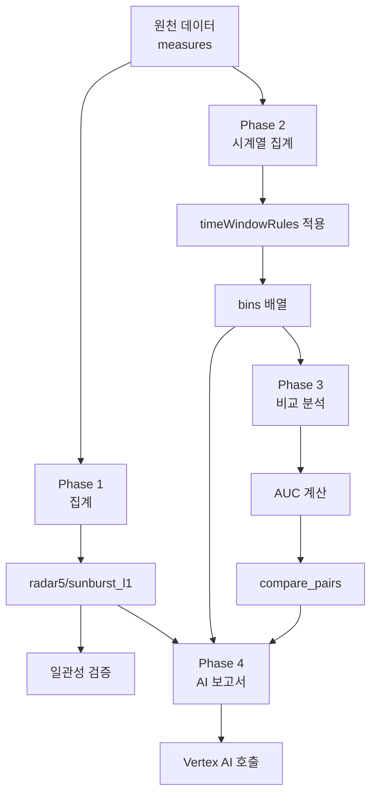
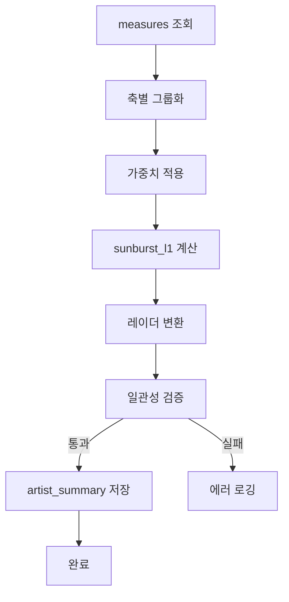
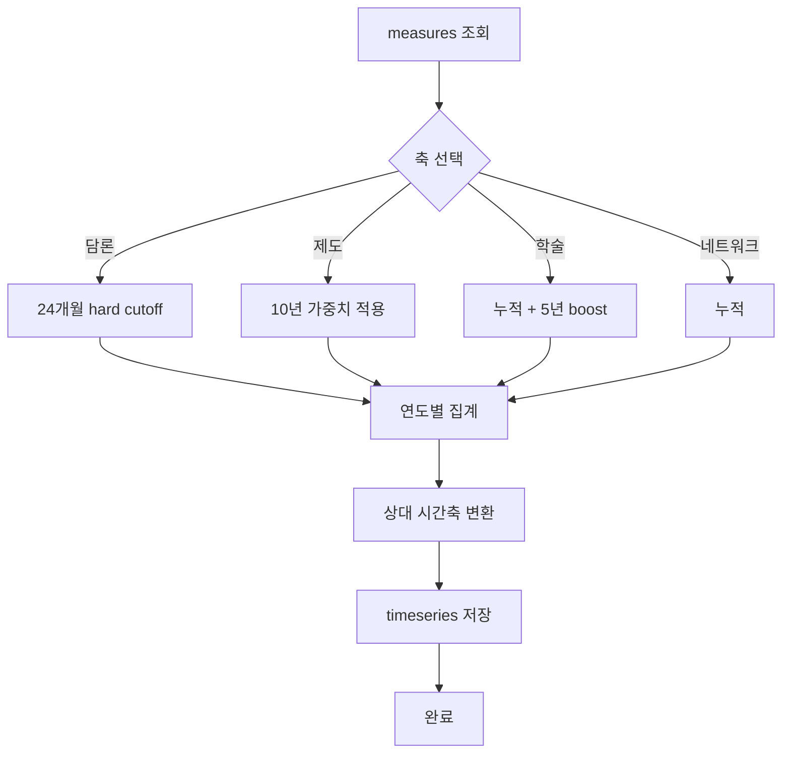
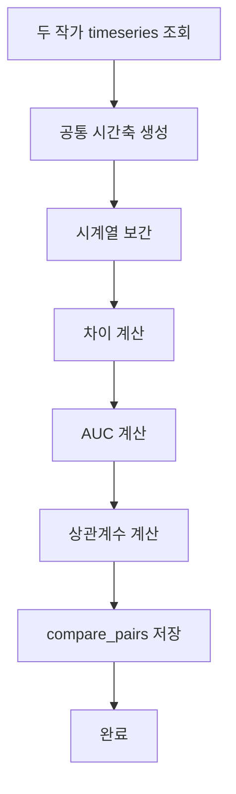
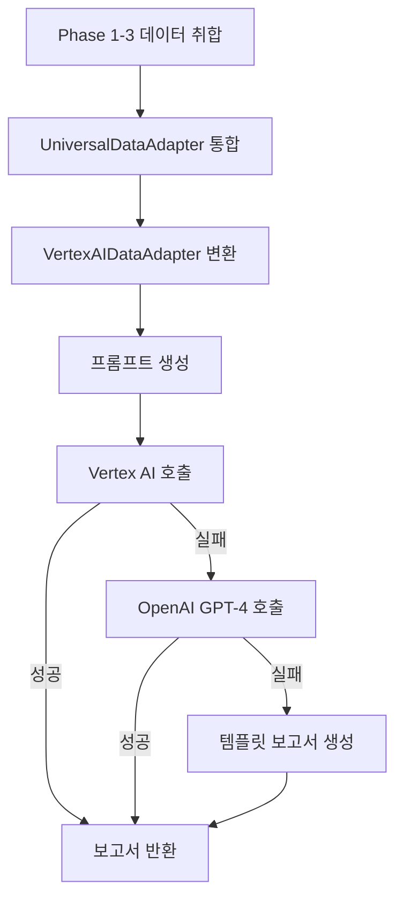
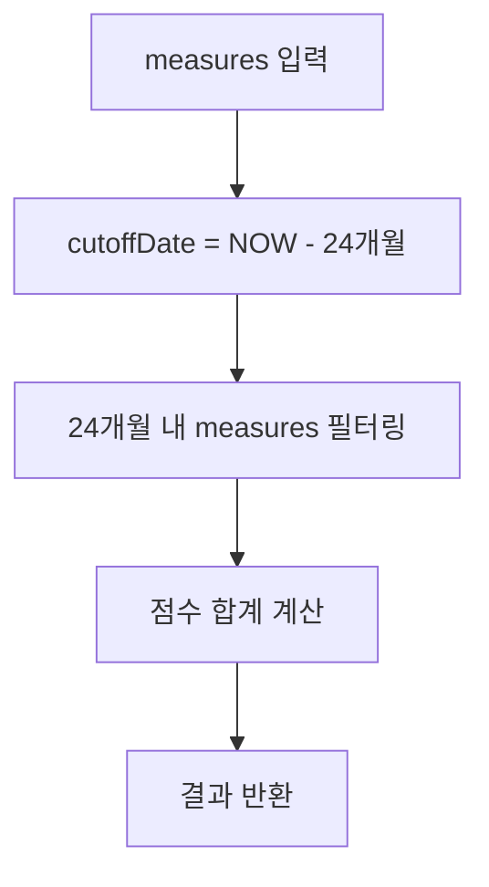
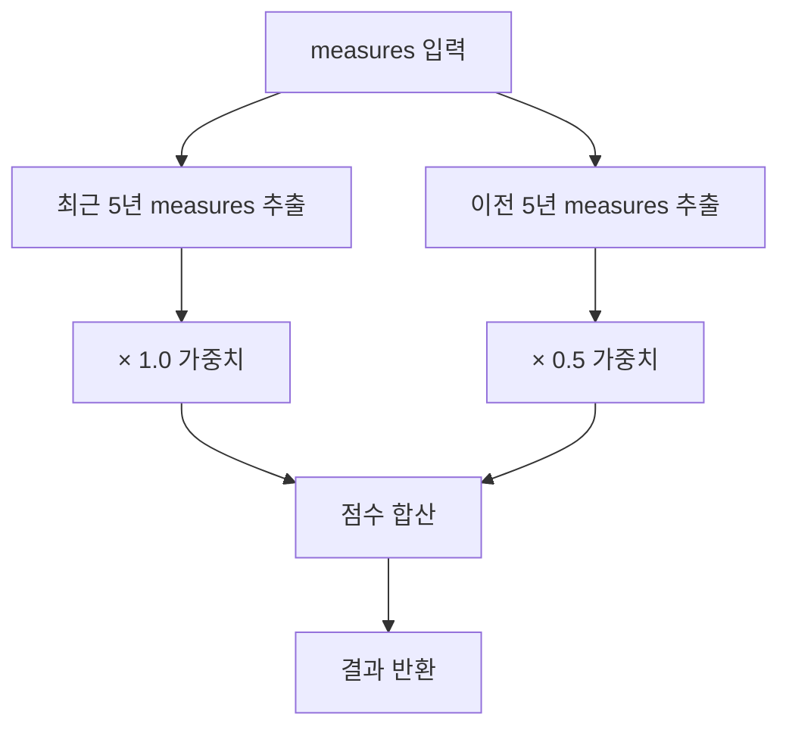
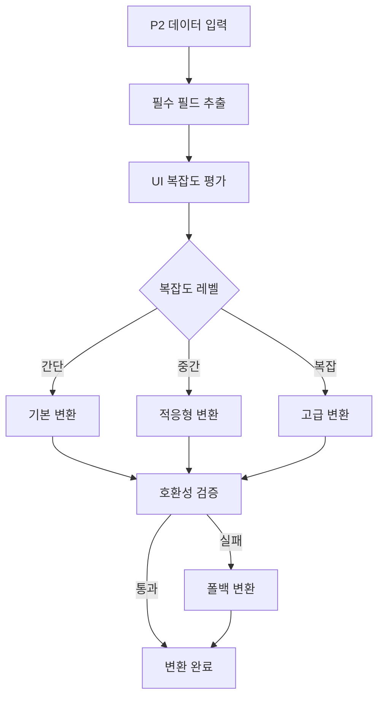
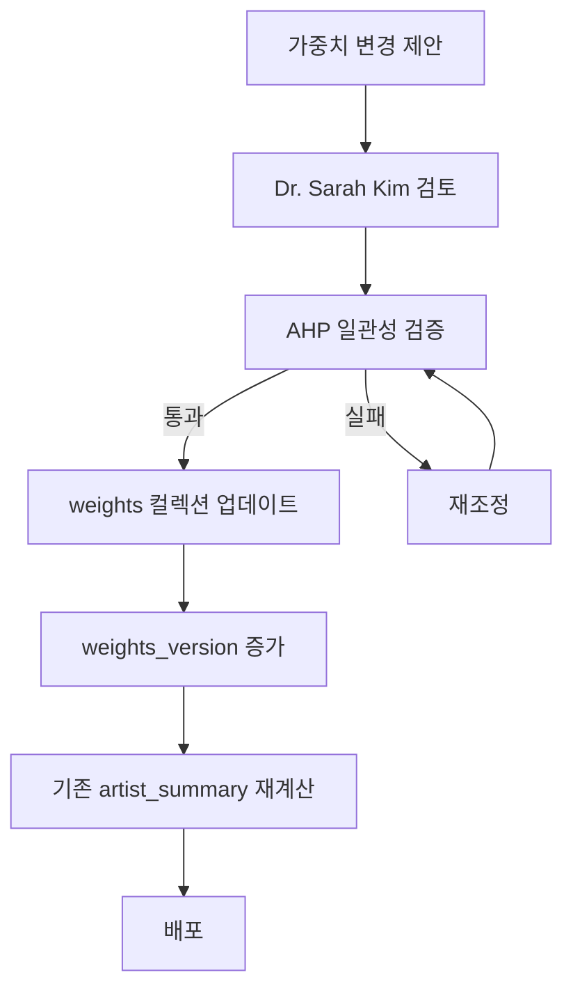

# CO-1016 CURATOR ODYSSEY: 비즈니스 로직 명세서

버전: 1.0  
최종 수정: 2025-01-XX  
작성자: Dr. Sarah Kim (Data Architect)  

## 목차

1. [비즈니스 로직 개요](#1-비즈니스-로직-개요)
2. [Phase별 핵심 기능](#2-phase별-핵심-기능)
3. [Time Window Rules 상세](#3-time-window-rules-상세)
4. [Universal Data Adapter 변환 로직](#4-universal-data-adapter-변환-로직)
5. [AI 보고서 프롬프트 템플릿](#5-ai-보고서-프롬프트-템플릿)
6. [가중치 및 버전 관리](#6-가중치-및-버전-관리)
7. [비즈니스 규칙 테이블](#7-비즈니스-규칙-테이블)

---

## 1. 비즈니스 로직 개요

### 1.1 핵심 원칙

1. **데이터 일관성**: ±0.5p 일관성 검증 필수
2. **시간적 분석**: 데뷔년 기준 상대 시간축 사용
3. **가중치 시스템**: AHP 기반 전문가 판단 가중치
4. **폴백 전략**: 실패 시 안전한 대체 데이터 제공

### 1.2 Phase별 처리 흐름



---

## 2. Phase별 핵심 기능

### 2.1 Phase 1: 현재 가치 분석

**목적**: 작가의 현재 가치를 5축 레이더와 4축 선버스트로 분석

**입력 데이터**: `measures` 컬렉션 (정규화 완료)

**처리 로직 (의사코드):**

```pseudocode
FUNCTION calculateArtistSummary(artistId):
  // 1. measures 컬렉션에서 작가 데이터 조회
  measures = QUERY measures WHERE entity_id = artistId
  
  // 2. 축별로 그룹화
  measuresByAxis = GROUP measures BY axis
  
  // 3. 각 축별 가중치 적용하여 집계
  FOR EACH axis IN ['제도', '학술', '담론', '네트워크']:
    axisMeasures = measuresByAxis[axis]
    
    // 가중치 적용 (weights 컬렉션에서 조회)
    weights = LOAD weights WHERE axis = axis AND version = 'AHP_v1'
    
    weightedSum = 0
    FOR EACH measure IN axisMeasures:
      metricWeight = weights[measure.metric_code]
      weightedSum += measure.value_normalized * metricWeight
    
    sunburst_l1[axis] = weightedSum
  
  // 4. 선버스트 → 레이더 변환
  radar5 = MAP sunburst_l1 TO radar5 USING mappingRules
  
  // 5. 일관성 검증 (±0.5p)
  consistency = VALIDATE radar5 AND sunburst_l1
  
  IF NOT consistency.valid:
    LOG ERROR "일관성 검증 실패"
    RETURN ERROR
  
  // 6. artist_summary 저장
  SAVE TO artist_summary {
    artist_id: artistId,
    radar5: radar5,
    sunburst_l1: sunburst_l1,
    weights_version: 'AHP_v1',
    updated_at: NOW()
  }
  
  RETURN artist_summary
END FUNCTION
```

**플로우차트:**



### 2.2 Phase 2: 커리어 궤적 분석

**목적**: 작가의 커리어 궤적을 시계열로 분석

**입력 데이터**: `measures` 컬렉션 + `timeWindowRules`

**처리 로직 (의사코드):**

```pseudocode
FUNCTION calculateTimeseries(artistId, axis):
  // 1. measures 조회
  measures = QUERY measures WHERE entity_id = artistId AND axis = axis
  
  // 2. 데뷔년 조회
  artist = LOAD entities WHERE entity_id = artistId
  debutYear = artist.debut_year
  
  // 3. Time Window Rules 적용
  rule = LOAD timeWindowRules WHERE axis = axis
  
  IF axis == '담론':
    // 24개월 hard cutoff
    cutoffDate = NOW() - 24 MONTHS
    filteredMeasures = FILTER measures WHERE time_window.end >= cutoffDate
    
  ELSE IF axis == '제도':
    // 10년 윈도우 (최근 5년 × 1.0, 이전 5년 × 0.5)
    recent5yDate = NOW() - 5 YEARS
    cutoff10yDate = NOW() - 10 YEARS
    
    recentMeasures = FILTER measures WHERE time_window.end >= recent5yDate
    previousMeasures = FILTER measures WHERE 
      time_window.end >= cutoff10yDate AND time_window.end < recent5yDate
    
    weightedSum = SUM(recentMeasures) * 1.0 + SUM(previousMeasures) * 0.5
    
  ELSE IF axis == '학술':
    // 누적 + 최근 5년 30% boost
    cumulativeSum = SUM(measures)
    recent5yMeasures = FILTER measures WHERE time_window.end >= (NOW() - 5 YEARS)
    recentBoost = SUM(recent5yMeasures) * 0.3
    
    weightedSum = cumulativeSum + recentBoost
    
  ELSE IF axis == '네트워크':
    // 누적
    weightedSum = SUM(measures)
  
  // 4. 연도별 집계
  bins = GROUP BY YEAR(measures.time_window.end)
  
  // 5. 상대 시간축 변환
  FOR EACH bin IN bins:
    bin.t = bin.year - debutYear
    bin.v = bin.weightedSum
  
  // 6. timeseries 저장
  SAVE TO timeseries {
    timeseries_id: CONCAT(artistId, '_', axis),
    artist_id: artistId,
    axis: axis,
    bins: bins,
    debut_year: debutYear,
    version: 'v1.0'
  }
  
  RETURN timeseries
END FUNCTION
```

**플로우차트:**



### 2.3 Phase 3: 비교 분석

**목적**: 두 작가의 시계열을 비교하여 궤적 차이 분석

**입력 데이터**: `timeseries` 컬렉션 (두 작가)

**처리 로직 (의사코드):**

```pseudocode
FUNCTION compareArtists(artistA_id, artistB_id, axis):
  // 1. 두 작가의 timeseries 조회
  timeseriesA = LOAD timeseries WHERE artist_id = artistA_id AND axis = axis
  timeseriesB = LOAD timeseries WHERE artist_id = artistB_id AND axis = axis
  
  // 2. 시계열 정렬 및 보간
  // 공통 시간축 생성 (두 작가의 t 범위 합집합)
  commonTimeRange = UNION timeseriesA.bins.t, timeseriesB.bins.t
  
  // 보간을 통한 공통 시점 생성
  interpolatedA = INTERPOLATE timeseriesA.bins AT commonTimeRange
  interpolatedB = INTERPOLATE timeseriesB.bins AT commonTimeRange
  
  // 3. 차이 계산
  series = []
  FOR EACH t IN commonTimeRange:
    v_A = interpolatedA[t]
    v_B = interpolatedB[t]
    diff = v_A - v_B
    
    series.APPEND {t: t, v_A: v_A, v_B: v_B, diff: diff}
  
  // 4. AUC (Area Under Curve) 차이 계산
  abs_diff_sum = SUM(ABS(series.diff))
  
  // 5. 상관계수 계산
  correlation = CORRELATE series.v_A, series.v_B
  
  // 6. compare_pairs 저장
  pair_id = CONCAT(artistA_id, '_', artistB_id, '_', axis)
  SAVE TO compare_pairs {
    pair_id: pair_id,
    artistA_id: artistA_id,
    artistB_id: artistB_id,
    axis: axis,
    series: series,
    abs_diff_sum: abs_diff_sum,
    correlation: correlation,
    calculated_at: NOW()
  }
  
  RETURN compare_pairs
END FUNCTION
```

**플로우차트:**



### 2.4 Phase 4: AI 보고서 생성

**목적**: Phase 1-3 데이터를 통합하여 AI 기반 종합 보고서 생성

**입력 데이터**: Phase 1-3 통합 데이터

**처리 로직 (의사코드):**

```pseudocode
FUNCTION generateAIReport(artistId):
  // 1. Phase 1-3 데이터 취합
  phase1Data = LOAD artist_summary WHERE artist_id = artistId
  phase2Data = LOAD timeseries WHERE artist_id = artistId
  phase3Data = LOAD compare_pairs WHERE artistA_id = artistId OR artistB_id = artistId
  
  // 2. UniversalDataAdapter로 통합
  adapter = NEW UniversalDataAdapter
  integratedData = adapter.adaptForP3UI({
    phase1: phase1Data,
    phase2: phase2Data,
    phase3: phase3Data
  })
  
  // 3. VertexAIDataAdapter로 AI 프롬프트 준비
  vertexAdapter = NEW VertexAITimeseriesAdapter
  promptData = vertexAdapter.adaptForVertexAI(phase2Data, phase3Data)
  
  // 4. 프롬프트 생성
  prompt = BUILD_PROMPT(integratedData, promptData)
  
  // 5. Vertex AI 호출 시도
  TRY:
    report = CALL VertexAI(prompt)
    RETURN report
  CATCH VertexAI_ERROR:
    // 폴백: OpenAI GPT-4
    TRY:
      report = CALL OpenAI_GPT4(prompt)
      RETURN report
    CATCH OpenAI_ERROR:
      // 폴백: 템플릿 기반 보고서
      report = GENERATE_TEMPLATE_REPORT(integratedData)
      RETURN report
  END TRY
END FUNCTION
```

**플로우차트:**



---

## 3. Time Window Rules 상세

### 3.1 담론 (24개월 hard cutoff)

**규칙**: `담론=24개월`

**수식:**
```
score = Σ(measures.value_normalized) WHERE time_window.end >= (NOW() - 24 months)
```

**코드 구현:**

```javascript
const apply담론TimeWindow = (measures, referenceDate = new Date()) => {
  const cutoffDate = new Date(referenceDate);
  cutoffDate.setMonth(cutoffDate.getMonth() - 24);
  
  // 24개월 내 measures만 필터링
  const validMeasures = measures.filter(measure => {
    const measureEndDate = parseMeasureTimeWindow(measure.time_window).end_date;
    return measureEndDate >= cutoffDate;
  });
  
  // 균등 가중치 적용
  const totalScore = validMeasures.reduce((sum, measure) => 
    sum + (measure.value_normalized || 0), 0
  );
  
  return {
    score: totalScore,
    measures_count: validMeasures.length,
    time_window_applied: '24months',
    cutoff_date: cutoffDate.toISOString()
  };
};
```

**플로우차트:**



### 3.2 제도 (10년 가중치)

**규칙**: `제도=10년(최근 5년 가중 1.0/이전 5년 0.5)`

**수식:**
```
recent5yScore = Σ(measures.value_normalized) WHERE time_window.end >= (NOW() - 5 years)
previous5yScore = Σ(measures.value_normalized) WHERE 
  time_window.end >= (NOW() - 10 years) AND time_window.end < (NOW() - 5 years)

score = recent5yScore × 1.0 + previous5yScore × 0.5
```

**코드 구현:**

```javascript
const apply제도TimeWindow = (measures, referenceDate = new Date()) => {
  const recent5yDate = new Date(referenceDate);
  recent5yDate.setFullYear(recent5yDate.getFullYear() - 5);
  
  const cutoff10yDate = new Date(referenceDate);
  cutoff10yDate.setFullYear(cutoff10yDate.getFullYear() - 10);
  
  // 시간대별 분류
  const recent5yMeasures = measures.filter(measure => {
    const measureEndDate = parseMeasureTimeWindow(measure.time_window).end_date;
    return measureEndDate >= recent5yDate;
  });
  
  const previous5yMeasures = measures.filter(measure => {
    const measureEndDate = parseMeasureTimeWindow(measure.time_window).end_date;
    return measureEndDate >= cutoff10yDate && measureEndDate < recent5yDate;
  });
  
  // 가중치 적용
  const recentScore = recent5yMeasures.reduce((sum, measure) => 
    sum + (measure.value_normalized || 0) * 1.0, 0
  );
  
  const previousScore = previous5yMeasures.reduce((sum, measure) =>
    sum + (measure.value_normalized || 0) * 0.5, 0
  );
  
  return {
    score: recentScore + previousScore,
    recent_5y: { score: recentScore, count: recent5yMeasures.length, weight: 1.0 },
    previous_5y: { score: previousScore / 0.5, weighted_score: previousScore, count: previous5yMeasures.length, weight: 0.5 }
  };
};
```

**플로우차트:**



### 3.3 학술 (누적 + 최근 5년 boost)

**규칙**: `학술=누적+최근 5년 가중`

**수식:**
```
cumulativeScore = Σ(measures.value_normalized) // 전체 누적
recent5yScore = Σ(measures.value_normalized) WHERE time_window.end >= (NOW() - 5 years)

score = cumulativeScore + (recent5yScore × 0.3)
```

**코드 구현:**

```javascript
const apply학술TimeWindow = (measures, referenceDate = new Date()) => {
  const recent5yDate = new Date(referenceDate);
  recent5yDate.setFullYear(recent5yDate.getFullYear() - 5);
  
  // 전체 누적 점수
  const cumulativeScore = measures.reduce((sum, measure) => 
    sum + (measure.value_normalized || 0), 0
  );
  
  // 최근 5년 추가 가산
  const recent5yMeasures = measures.filter(measure => {
    const measureEndDate = parseMeasureTimeWindow(measure.time_window).end_date;
    return measureEndDate >= recent5yDate;
  });
  
  const recentBoost = recent5yMeasures.reduce((sum, measure) =>
    sum + (measure.value_normalized || 0), 0
  ) * 0.3; // 30% 가산
  
  return {
    score: cumulativeScore + recentBoost,
    cumulative: { score: cumulativeScore, count: measures.length },
    recent_boost: { base_score: recentBoost / 0.3, boost_score: recentBoost, count: recent5yMeasures.length, coefficient: 0.3 }
  };
};
```

### 3.4 네트워크 (누적)

**규칙**: `네트워크=누적`

**수식:**
```
score = Σ(measures.value_normalized) // 전체 누적
```

**코드 구현:**

```javascript
const apply네트워크TimeWindow = (measures) => {
  const totalScore = measures.reduce((sum, measure) =>
    sum + (measure.value_normalized || 0), 0
  );
  
  return {
    score: totalScore,
    measures_count: measures.length,
    time_window_applied: 'cumulative'
  };
};
```

---

## 4. Universal Data Adapter 변환 로직

### 4.1 adaptForP3UI() 함수

**목적**: P2 복잡한 스키마를 P3 UI 호환 형식으로 변환

**입력 형식:**
```javascript
{
  artist_id: string,
  radar5: {I, F, A, M, Sedu},
  sunburst_l1: {제도, 학술, 담론, 네트워크},
  timeseries: {bins: [{t, v}]},
  comparison: {series: [{t, v_A, v_B}]}
}
```

**출력 형식:**
```javascript
{
  artist_id: string,
  name: string,
  radar5: {I, F, A, M, Sedu},
  sunburst_l1: {제도, 학술, 담론, 네트워크},
  phase2: {
    timeseries: {bins: [{t, v}]}
  },
  phase3: {
    comparison: {series: [{t, v_A, v_B, diff}]}
  }
}
```

**플로우차트:**



**알고리즘:**

```pseudocode
FUNCTION adaptForP3UI(p2ComplexData, uiComplexityLevel):
  // 1. 필수 필드 보장
  essentialData = extractEssentialFields(p2ComplexData)
  
  // 2. UI 복잡도에 따른 적응형 변환
  adaptedData = applyAdaptiveTransformation(essentialData, p2ComplexData, uiComplexityLevel)
  
  // 3. 안전성 검증
  validationResult = validateP3Compatibility(adaptedData)
  
  IF NOT validationResult.isCompatible:
    RETURN applyFallbackTransformation(p2ComplexData)
  
  RETURN adaptedData
END FUNCTION
```

### 4.2 extractAnalysisInsights() 함수

**목적**: 분석 인사이트 추출

**출력 형식:**
```javascript
{
  basic: {
    totalScore: number,
    dominantAxis: string,
    maturityLevel: string
  },
  temporal: {
    growthRate: number,
    volatility: number,
    inflectionPoints: array
  },
  quality: {
    consistencyScore: number,
    dataCompleteness: number
  },
  performance: {
    calculationTime: number,
    dataSize: number
  }
}
```

---

## 5. AI 보고서 프롬프트 템플릿

### 5.1 프롬프트 구조

**템플릿 변수:**
- `{artist_name}`: 작가 이름
- `{debut_year}`: 데뷔년도
- `{radar5}`: 레이더 5축 데이터
- `{sunburst_l1}`: 선버스트 4축 데이터
- `{timeseries_summary}`: 시계열 요약
- `{growth_patterns}`: 성장 패턴
- `{event_impacts}`: 이벤트 영향도

**프롬프트 예시:**

```
당신은 예술가 커리어 분석 전문가입니다. 다음 데이터를 바탕으로 종합 분석 보고서를 작성해주세요.

## 작가 정보
- 이름: {artist_name}
- 데뷔년도: {debut_year}
- 커리어 기간: {career_duration}년

## 현재 가치 분석 (Phase 1)
### 5축 레이더 차트
- Institution (기관전시): {radar5.I}
- Fair (아트페어): {radar5.F}
- Award (시상): {radar5.A}
- Media (미디어): {radar5.M}
- Seduction (교육): {radar5.Sedu}

### 4축 선버스트 구조
- 제도: {sunburst_l1.제도}
- 학술: {sunburst_l1.학술}
- 담론: {sunburst_l1.담론}
- 네트워크: {sunburst_l1.네트워크}

## 커리어 궤적 분석 (Phase 2)
{timeseries_summary}

## 성장 패턴
{growth_patterns}

## 주요 이벤트 영향도
{event_impacts}

## 보고서 작성 지침
1. 작가의 강점과 특징을 분석하세요.
2. 커리어 궤적의 주요 변곡점을 설명하세요.
3. 미래 잠재력을 평가하세요.
4. 마크다운 형식으로 작성하세요.
```

### 5.2 토큰 최적화 로직

**압축 전략:**

1. **핵심 시점만 추출**: 전체 시계열 대신 변곡점, 마일스톤만 포함
2. **통계 요약**: 세부 데이터 대신 통계 지표 사용
3. **중요도 기반 필터링**: 중요도 높은 데이터 우선 포함

**코드 예시:**

```javascript
compressTimeseriesData(timeseriesData) {
  const bins = timeseriesData.bins;
  
  // 핵심 시점 추출 (시작, 변곡점, 최신)
  const keyTimepoints = this.identifyKeyTimepoints(bins);
  
  // 성장 세그먼트 분석
  const growthSegments = this.analyzeGrowthSegments(bins);
  
  return {
    key_timepoints: keyTimepoints, // 전체의 10-20%만 포함
    growth_segments: growthSegments,
    statistical_summary: this.generateStatisticalSummary(bins)
  };
}
```

### 5.3 폴백 시나리오

**순서:**
1. Vertex AI Gemini 1.5 Pro 호출 시도
2. 실패 시 OpenAI GPT-4 호출
3. 실패 시 템플릿 기반 보고서 생성

**템플릿 보고서 예시:**

```markdown
# {artist_name} 종합 분석 보고서

## 현재 가치 요약
- 총점: {total_score}
- 주요 강점: {dominant_axis}

## 커리어 궤적
- 성장률: {growth_rate}% /년
- 주요 변곡점: {inflection_points}

## 평가
{automated_analysis}
```

---

## 6. 가중치 및 버전 관리

### 6.1 weights_version 필드 업데이트 프로세스

**버전 형식**: `AHP_v{major}.{minor}`

**업데이트 트리거:**
1. 새로운 가중치 체계 도입
2. AHP 일관성 비율 개선
3. 전문가 평가 업데이트

**프로세스:**



### 6.2 버전 호환성 체크 로직

```javascript
function checkWeightsCompatibility(currentVersion, targetVersion) {
  const [currentMajor, currentMinor] = currentVersion.split('.').map(Number);
  const [targetMajor, targetMinor] = targetVersion.split('.').map(Number);
  
  // Major 버전이 다르면 호환 불가
  if (currentMajor !== targetMajor) {
    return { compatible: false, reason: 'major_version_mismatch' };
  }
  
  // Minor 버전이 더 높으면 호환 가능
  if (currentMinor >= targetMinor) {
    return { compatible: true };
  }
  
  // Minor 버전이 낮으면 재계산 필요
  return { compatible: false, reason: 'minor_version_outdated', requires_recalculation: true };
}
```

---

## 7. 비즈니스 규칙 테이블

### 7.1 축별 시간창 규칙 요약

| 축 | 시간창 규칙 | 가중치 | 수식 |
|----|------------|--------|------|
| 담론 | 24개월 hard cutoff | 균등 (1.0) | `score = Σ(measures) WHERE time >= NOW() - 24m` |
| 제도 | 10년 (5년/5년) | 최근 5년 1.0, 이전 5년 0.5 | `score = recent5y × 1.0 + previous5y × 0.5` |
| 학술 | 누적 + 최근 5년 boost | 누적 1.0, 최근 5년 +30% | `score = cumulative + (recent5y × 0.3)` |
| 네트워크 | 누적 | 균등 (1.0) | `score = Σ(measures)` |

### 7.2 매핑 규칙 요약 (선버스트 → 레이더)

| 레이더 축 | 선버스트 축 | 매핑 비율 | 수식 |
|----------|------------|----------|------|
| I (Institution) | 제도 | 70% | `I = 제도 × 0.7` |
| F (Fair) | 제도 | 30% | `F = 제도 × 0.3` |
| A (Award) | 학술 | 60% | `A = 학술 × 0.6` |
| M (Media) | 담론 | 80% | `M = 담론 × 0.8` |
| Sedu (Seduction) | 학술 | 15% | `Sedu = 학술 × 0.15` |

### 7.3 일관성 검증 규칙

| 항목 | 규칙 | 허용 오차 |
|------|------|----------|
| 레이더-선버스트 합계 차이 | `|radarSum - mappedSum| ≤ 0.5` | ±0.5p |
| 데이터 완성도 | 필수 필드 존재율 ≥ 85% | 15% 미만 |
| 시계열 연속성 | 빈 구간 ≤ 3년 | 3년 초과 시 보간 |

---

**문서 버전 관리:**
- v1.0 (2025-01-XX): 초기 작성
- 향후 업데이트: 새로운 비즈니스 규칙 추가 시 업데이트 예정

