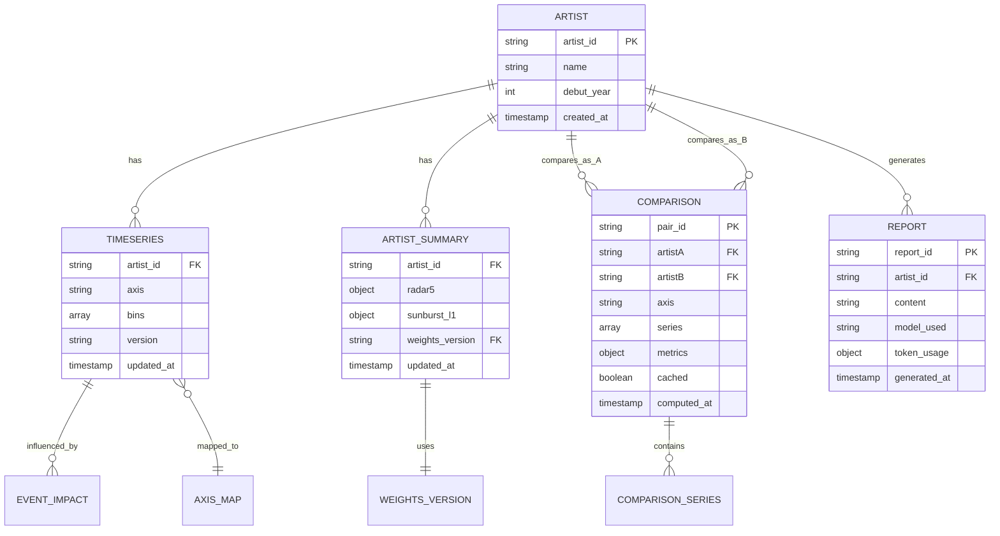

# CO-1016 CURATOR ODYSSEY: Information Architecture Document (IA) v1.0

## 문서 메타데이터 (Document Metadata)

**문서명**: CO-1016 CURATOR ODYSSEY Information Architecture Document (IA) v1.0

**버전**: 1.0

**상태**: Draft (초안, FRD v1.0 기반)

**최종 수정**: 2025-11-02

**소유자**: NEO GOD (Director)

**승인자**: Data Architect (TBD)

**개정 이력**:
- v1.0 (2025-11-02): FRD v1.0 기반 초기 작성

**배포 범위**: Data Team, Backend Development Team, Frontend Development Team

**변경 관리 프로세스**: GitHub Issues/PR 워크플로, 변경 시 FRD/TSD 동시 업데이트

**참조 문서 (References)**:
- **[FRD v1.0](../requirements/FRD.md)** - Functional Requirements Document, 데이터 흐름 및 논리 데이터 모델
- **[Data Model Specification](../data/DATA_MODEL_SPECIFICATION.md)** - Firestore 스키마 상세, ER 다이어그램
- **[API Specification v1.0](../api/API_SPECIFICATION.md)** - API 엔드포인트 정의

---

## 1. IA 개요 (IA Overview)

### 1.1 목적 (Purpose)

본 문서는 CO-1016 CURATOR ODYSSEY 플랫폼의 정보 아키텍처를 정의한다. 엔티티(Artist, Timeseries, Comparison, Report) 간 관계를 명확히 하며, 사용자 규모(MVP 30명)와 성능 제약(p95 <300ms)을 고려한 데이터 계층화 및 네비게이션 구조를 제공한다.

### 1.2 사용자 규모 (User Scale)

**MVP**: 30명 사용자
- 동시 사용자: 최대 10명
- 일일 활성 사용자: 20명
- 월간 활성 사용자: 30명

### 1.3 성능 제약 (Performance Constraints)

**API 응답 시간**:
- p95 < 300ms (시계열 조회)
- p95 < 2초 (요약 조회)
- p95 < 500ms (배치 API)

**Firestore 읽기 ops**:
- 목표: < 1M ops/month
- 최적화: 인덱스 히트율 99%, 캐싱 레이어 활용

### 1.4 문서 개요 (Document Overview)

본 문서는 다음과 같은 구조로 구성된다:

1. **IA 개요**: 목적, 사용자 규모, 성능 제약
2. **엔티티 관계 모델**: ER 다이어그램, 엔티티 간 관계
3. **네비게이션 맵**: Phase별 네비게이션 구조
4. **데이터 계층화**: 캐싱 레이어, 인덱스 최적화
5. **검색/필터링 구조**: 축 enum, 시간창 필터
6. **Neo4j 그래프 DB 확장**: 노드/엣지 스키마 예시

---

## 2. 엔티티 관계 모델 (Entity Relationship Model)

### 2.1 ER 다이어그램 (ER Diagram)



### 2.2 엔티티 상세 (Entity Details)

#### 2.2.1 Artist (아티스트)

**Firestore 컬렉션**: `entities` (또는 `artists`)

**주요 필드**:
- `artist_id` (PK): `ARTIST_\d{4}` 패턴
- `name`: 아티스트 이름
- `debut_year`: 데뷔년도 (t_relative 계산용)

**관계**:
- `artist_id` → `timeseries.artist_id` (1:N)
- `artist_id` → `artist_summary.artist_id` (1:1)
- `artist_id` → `comparison.artistA` 또는 `artistB` (1:N)
- `artist_id` → `report.artist_id` (1:N)

**예시**:
```json
{
  "artist_id": "ARTIST_0005",
  "name": "양혜규",
  "debut_year": 2010,
  "created_at": "2025-01-01T00:00:00Z"
}
```

---

#### 2.2.2 Timeseries (시계열)

**Firestore 컬렉션**: `timeseries`

**주요 필드**:
- `artist_id` (FK): 아티스트 ID
- `axis`: 축 enum (제도, 학술, 담론, 네트워크)
- `bins`: 배열 `[{t: number, v: number}]`
- `version`: 데이터 버전

**복합 인덱스**: `(artist_id, axis, version DESC)`

**관계**:
- `artist_id` → `Artist.artist_id` (N:1)
- `axis` → `AxisMap.axis` (N:1)

**예시**:
```json
{
  "artist_id": "ARTIST_0005",
  "axis": "제도",
  "bins": [
    { "t": 0, "v": 0.1 },
    { "t": 5, "v": 0.45 },
    { "t": 10, "v": 0.78 }
  ],
  "version": "v1.0",
  "updated_at": "2025-11-02T00:00:00Z"
}
```

---

#### 2.2.3 ArtistSummary (아티스트 요약)

**Firestore 컬렉션**: `artist_summary`

**주요 필드**:
- `artist_id` (FK): 아티스트 ID
- `radar5`: 객체 `{I, F, A, M, Sedu}`
- `sunburst_l1`: 객체 `{제도, 학술, 담론, 네트워크}`
- `weights_version`: 가중치 버전

**관계**:
- `artist_id` → `Artist.artist_id` (1:1)
- `weights_version` → `WeightsVersion.version` (N:1)

**예시**:
```json
{
  "artist_id": "ARTIST_0005",
  "name": "양혜규",
  "radar5": {
    "I": 97.5,
    "F": 90.0,
    "A": 92.0,
    "M": 86.0,
    "Sedu": 9.8
  },
  "sunburst_l1": {
    "제도": 0.912,
    "학술": 0.880,
    "담론": 0.860,
    "네트워크": 0.900
  },
  "weights_version": "AHP_v1",
  "updated_at": "2025-11-02T00:00:00Z",
  "consistency_check": {
    "passed": true,
    "error": 0.2
  }
}
```

---

#### 2.2.4 Comparison (비교)

**Firestore 컬렉션**: `compare_pairs`

**주요 필드**:
- `pair_id` (PK): `ARTIST_\d{4}_vs_\d{4}` 패턴
- `artistA` (FK): 첫 번째 아티스트 ID
- `artistB` (FK): 두 번째 아티스트 ID
- `axis`: 축 enum
- `series`: 배열 `[{t, v_A, v_B, diff}]`
- `metrics`: 객체 `{correlation, abs_diff_sum, auc}`
- `cached`: 캐시 사용 여부
- `computed_at`: 계산 시간

**관계**:
- `artistA` → `Artist.artist_id` (N:1)
- `artistB` → `Artist.artist_id` (N:1)

**예시**:
```json
{
  "pair_id": "ARTIST_0005_vs_0010",
  "artistA": "ARTIST_0005",
  "artistB": "ARTIST_0010",
  "axis": "제도",
  "series": [
    { "t": 0, "v_A": 0.1, "v_B": 0.2, "diff": -0.1 },
    { "t": 5, "v_A": 0.45, "v_B": 0.50, "diff": -0.05 }
  ],
  "metrics": {
    "correlation": 0.85,
    "abs_diff_sum": 0.15,
    "auc": 0.78
  },
  "cached": true,
  "computed_at": "2025-11-02T00:00:00Z"
}
```

---

#### 2.2.5 Report (AI 보고서)

**Firestore 컬렉션**: `reports` (옵션, 캐싱용)

**주요 필드**:
- `report_id` (PK): `REPORT_\d{3}` 패턴
- `artist_id` (FK): 아티스트 ID
- `content`: Markdown 문자열
- `model_used`: 모델 이름 (gemini-1.5-pro, gpt-4, template)
- `token_usage`: 객체 `{input, output}`
- `generated_at`: 생성 시간

**관계**:
- `artist_id` → `Artist.artist_id` (N:1)

**예시**:
```json
{
  "report_id": "REPORT_001",
  "artist_id": "ARTIST_0005",
  "content": "# 아티스트 분석 보고서\n\n## Introduction\n...",
  "model_used": "gemini-1.5-pro",
  "token_usage": {
    "input": 38000,
    "output": 2000
  },
  "generated_at": "2025-11-02T00:00:00Z"
}
```

---

### 2.3 엔티티 간 관계 매핑 (Entity Relationship Mapping)

**핵심 관계**:

1. **Artist → Timeseries** (1:N)
   - 한 아티스트는 여러 시계열 데이터를 가짐 (4축)
   - 관계: `artist_id`로 조인

2. **Artist → ArtistSummary** (1:1)
   - 한 아티스트는 하나의 요약 데이터를 가짐
   - 관계: `artist_id`로 조인

3. **Artist → Comparison** (1:N)
   - 한 아티스트는 여러 비교 쌍에 참여 (A 또는 B)
   - 관계: `artistA` 또는 `artistB`로 조인

4. **Timeseries → EventImpact** (1:N)
   - 한 시계열 데이터는 여러 이벤트 영향도를 가짐
   - 관계: `artist_id` + `axis` + `t`로 조인

5. **Comparison → ComparisonSeries** (1:N)
   - 한 비교 쌍은 여러 시계열 데이터 포인트를 가짐
   - 관계: `pair_id`로 포함

---

## 3. 네비게이션 맵 (Navigation Map)

### 3.1 Phase별 네비게이션 구조

```
홈페이지 (/)
  │
  ├── Phase 1: 현재 가치 분석 (/artist/:id)
  │     ├── 요약 데이터 조회 (GET /api/artist/:id/summary)
  │     ├── 레이더 차트 (Radar5Chart)
  │     └── 선버스트 차트 (SunburstChart)
  │
  ├── Phase 2: 커리어 궤적 분석 (/artist/:id/trajectory)
  │     ├── 시계열 데이터 조회 (POST /api/batch/timeseries)
  │     ├── StackedAreaChart (4축 누적)
  │     └── EventTimeline (이벤트 타임라인)
  │
  ├── Phase 3: 비교 분석 (/compare)
  │     ├── 비교 데이터 조회 (GET /api/compare/:A/:B/:axis)
  │     └── ComparisonAreaChart (dual-line)
  │
  └── Phase 4: AI 보고서 (/artist/:id/report)
        ├── 보고서 생성 (POST /api/report/generate)
        └── MarkdownReportDisplay
```

### 3.2 네비게이션 플로우

**주요 플로우**:

1. **홈 → Phase 1**: 아티스트 ID 입력 → 요약 데이터 로드 → 레이더/선버스트 렌더링
2. **Phase 1 → Phase 2**: Phase 2 탭 클릭 → 배치 API 호출 → 시계열 차트 렌더링
3. **Phase 1 → Phase 3**: 비교 페이지 이동 → 아티스트 A/B 선택 → 비교 차트 렌더링
4. **Phase 1-3 → Phase 4**: 보고서 생성 버튼 클릭 → AI 호출 → Markdown 렌더링

**대안 플로우**:

- **Phase 2 → Phase 1**: Phase 1 탭 클릭 → 캐시된 요약 데이터 표시
- **Phase 3 → Phase 1**: 아티스트 A/B 개별 페이지로 이동

---

## 4. 데이터 계층화 (Data Layering)

### 4.1 캐싱 레이어 (Caching Layer)

**React Query 캐싱 (클라이언트)**:

| 데이터 타입 | 쿼리 키 | staleTime | cacheTime |
|------------|---------|-----------|-----------|
| 요약 데이터 | `['artist', id, 'summary']` | 5분 | 10분 |
| 시계열 데이터 | `['artist', id, 'batch-timeseries']` | 5분 | 10분 |
| 비교 데이터 | `['compare', A, B, axis]` | 24시간 | 48시간 |
| AI 보고서 | `['report', id]` | 1시간 | 2시간 |

**Firestore 캐싱 (서버)**:

- `compare_pairs` 컬렉션: 24시간 TTL
- `artist_summary` 컬렉션: 사전 계산 (ETL 파이프라인)

**함수 레벨 캐싱 (옵션)**:

- In-memory 캐시: 5분 TTL (Node.js 변수)
- Redis 캐시: 향후 확장 시 (서버리스 호환)

### 4.2 인덱스 최적화 (Index Optimization)

**Firestore 복합 인덱스**:

| 컬렉션 | 인덱스 필드 | 용도 |
|--------|------------|------|
| `timeseries` | `(artist_id, axis, version DESC)` | 시계열 조회 |
| `compare_pairs` | `(artistA, artistB, axis)` | 비교 데이터 조회 |
| `artist_summary` | `(artist_id, updated_at DESC)` | 최신 요약 데이터 |

**인덱스 히트율 목표**: 99%

**쿼리 최적화**:
- `.limit(50)` 적용 (시계열 bins)
- `.orderBy()` + `.limit()` 조합
- `.where()` 조건 순서 최적화

### 4.3 데이터 계층화 다이어그램

```
┌─────────────────────────────────┐
│   React Query (클라이언트 캐시)  │
│   staleTime: 5분-24시간         │
└──────────────┬──────────────────┘
               │
               ▼
┌─────────────────────────────────┐
│   Firebase Functions (API)      │
│   In-memory 캐시: 5분 TTL       │
└──────────────┬──────────────────┘
               │
               ▼
┌─────────────────────────────────┐
│   Firestore (데이터베이스)       │
│   복합 인덱스: 99% 히트율         │
└──────────────┬──────────────────┘
               │
               ▼
┌─────────────────────────────────┐
│   ETL 파이프라인 (사전 계산)      │
│   artist_summary, compare_pairs  │
└─────────────────────────────────┘
```

---

## 5. 검색/필터링 구조 (Search/Filtering Structure)

### 5.1 축 Enum 필터 (Axis Enum Filter)

**4축 Enum**:
- `제도`: 제도적 성취 (기관전시, 상 등)
- `학술`: 학술적 활동 (논문, 학회 등)
- `담론`: 담론적 영향 (미디어, 비평 등)
- `네트워크`: 네트워크 연결 (협업, 관계 등)

**필터 적용**:
- Phase 2: 4축 선택 (기본: 모두 선택)
- Phase 3: 단일 축 선택 (드롭다운)

**API 엔드포인트**:
- `GET /api/artist/{id}/timeseries/{axis}`: 단일 축 필터
- `POST /api/batch/timeseries`: 다중 축 필터 (axes 배열)

### 5.2 시간창 필터 (Time Window Filter)

**시간창 옵션**:
- `default`: 기본 Time Window Rules 적용
- `custom`: 사용자 지정 시간 범위 (향후)

**Time Window Rules**:
- 제도: 10년 윈도우 (최근 5년 가중 1.0, 이전 5년 가중 0.5)
- 학술: 누적 + boost (최근 5년 +30%)
- 담론: 24개월 윈도우
- 네트워크: 누적 (전체 기간)

**API 파라미터**:
- `window`: 시간창 옵션 (Query Parameter)

### 5.3 아티스트 검색 (Artist Search)

**검색 방식**:
- 아티스트 ID 입력: `ARTIST_\d{4}` 패턴
- 이름 검색: 향후 확장 (전체 텍스트 검색)

**검색 UI**:
- 입력 필드: `data-testid="artist-id-input"`
- 자동완성: 향후 확장 (Firestore 쿼리)

---

## 6. Firestore 컬렉션 및 API 엔드포인트 매핑 (Firestore Collection & API Endpoint Mapping)

### 6.1 컬렉션 → API 매핑 테이블

| Firestore 컬렉션 | API 엔드포인트 | 메서드 | Phase |
|-----------------|---------------|--------|-------|
| `artist_summary` | `/api/artist/{id}/summary` | GET | Phase 1 |
| `sunburst_snapshots` | `/api/artist/{id}/sunburst` | GET | Phase 1 |
| `timeseries` | `/api/artist/{id}/timeseries/{axis}` | GET | Phase 2 |
| `timeseries` | `/api/batch/timeseries` | POST | Phase 2 |
| `events` | `/api/artist/{id}/events/{axis}` | GET | Phase 2 |
| `compare_pairs` | `/api/compare/{artistA}/{artistB}/{axis}` | GET | Phase 3 |
| `reports` (옵션) | `/api/report/generate` | POST | Phase 4 |

### 6.2 데이터 흐름 매핑

**Phase 1**:
```
Firestore artist_summary
  → API GET /api/artist/{id}/summary
  → React Query 캐시 (5분)
  → Radar5Chart / SunburstChart 렌더링
```

**Phase 2**:
```
Firestore timeseries (4축)
  → API POST /api/batch/timeseries
  → React Query 캐시 (5분)
  → StackedAreaChart 렌더링
```

**Phase 3**:
```
Firestore compare_pairs (캐시 확인)
  → API GET /api/compare/{A}/{B}/{axis}
  → React Query 캐시 (24시간)
  → ComparisonAreaChart 렌더링
```

**Phase 4**:
```
Firestore artist_summary + timeseries + compare_pairs
  → API POST /api/report/generate
  → Vertex AI 호출
  → MarkdownReportDisplay 렌더링
```

---

## 7. Neo4j 그래프 DB 확장 가능성 (Neo4j Graph DB Extension)

### 7.1 노드 스키마 (Node Schema)

**Artist 노드**:
```cypher
CREATE (a:Artist {
  artist_id: 'ARTIST_0005',
  name: '양혜규',
  debut_year: 2010
})
```

**Event 노드**:
```cypher
CREATE (e:Event {
  event_id: 'EVENT_001',
  type: '전시',
  date: '2015-01-01'
})
```

**Axis 노드**:
```cypher
CREATE (ax:Axis {
  axis_id: '제도',
  name: '제도적 성취'
})
```

### 7.2 엣지 스키마 (Edge Schema)

**관계 유형**:

1. **ARTIST_HAS_TIMESERIES**:
```cypher
(a:Artist)-[r:ARTIST_HAS_TIMESERIES {
  axis: '제도',
  version: 'v1.0'
}]->(t:Timeseries)
```

2. **ARTIST_PARTICIPATES_IN_EVENT**:
```cypher
(a:Artist)-[r:ARTIST_PARTICIPATES_IN_EVENT {
  impact: 0.5,
  delta_v: 0.3
}]->(e:Event)
```

3. **ARTIST_COMPARED_WITH**:
```cypher
(a1:Artist)-[r:ARTIST_COMPARED_WITH {
  axis: '제도',
  correlation: 0.85,
  abs_diff_sum: 0.15
}]->(a2:Artist)
```

4. **TIMESERIES_MAPPED_TO_AXIS**:
```cypher
(t:Timeseries)-[r:TIMESERIES_MAPPED_TO_AXIS]->(ax:Axis)
```

### 7.3 그래프 쿼리 예시 (Graph Query Examples)

**아티스트의 모든 시계열 데이터 조회**:
```cypher
MATCH (a:Artist {artist_id: 'ARTIST_0005'})-[:ARTIST_HAS_TIMESERIES]->(t:Timeseries)
RETURN t.axis, t.bins
```

**이벤트 영향도가 높은 아티스트 조회**:
```cypher
MATCH (a:Artist)-[r:ARTIST_PARTICIPATES_IN_EVENT]->(e:Event)
WHERE r.impact > 0.5
RETURN a.artist_id, a.name, e.event_id, r.impact
ORDER BY r.impact DESC
LIMIT 10
```

**비교 대상 아티스트 추천**:
```cypher
MATCH (a1:Artist {artist_id: 'ARTIST_0005'})-[r:ARTIST_COMPARED_WITH]->(a2:Artist)
WHERE r.correlation > 0.8
RETURN a2.artist_id, a2.name, r.correlation, r.abs_diff_sum
ORDER BY r.correlation DESC
```

### 7.4 마이그레이션 전략 (Migration Strategy)

**현재 (Firestore)**:
- 관계형 데이터는 문서 ID로 참조
- 복합 쿼리 제한적

**향후 (Neo4j)**:
- 관계형 데이터를 엣지로 모델링
- 복잡한 그래프 쿼리 지원 (예: 2-hop 관계)

**마이그레이션 단계**:
1. **Phase 1**: Firestore 유지, Neo4j 병행 운영
2. **Phase 2**: Neo4j로 읽기 쿼리 전환 (쓰기는 Firestore)
3. **Phase 3**: Neo4j로 완전 전환 (Firestore는 백업)

---

## 8. 부록 (Appendix)

### 8.1 엔티티 관계 요약 테이블

| 엔티티 | PK | 주요 FK | 관계 수 |
|--------|-----|---------|---------|
| Artist | artist_id | - | 4개 (timeseries, summary, comparison, report) |
| Timeseries | (artist_id, axis) | artist_id | 1개 (Artist) |
| ArtistSummary | artist_id | artist_id, weights_version | 2개 (Artist, WeightsVersion) |
| Comparison | pair_id | artistA, artistB | 2개 (Artist × 2) |
| Report | report_id | artist_id | 1개 (Artist) |

### 8.2 네비게이션 맵 요약

| Phase | 경로 | 주요 컴포넌트 | API 엔드포인트 |
|-------|------|--------------|---------------|
| Phase 1 | `/artist/:id` | Radar5Chart, SunburstChart | GET `/api/artist/:id/summary` |
| Phase 2 | `/artist/:id/trajectory` | StackedAreaChart, EventTimeline | POST `/api/batch/timeseries` |
| Phase 3 | `/compare` | ComparisonAreaChart | GET `/api/compare/:A/:B/:axis` |
| Phase 4 | `/artist/:id/report` | MarkdownReportDisplay | POST `/api/report/generate` |

### 8.3 데이터 계층화 요약

| 레이어 | 기술 | TTL | 용도 |
|--------|------|-----|------|
| 클라이언트 캐시 | React Query | 5분-24시간 | UI 렌더링 최적화 |
| 서버 캐시 | In-memory | 5분 | API 응답 최적화 |
| 데이터베이스 | Firestore | 영구 | 데이터 저장 |
| 사전 계산 | ETL 파이프라인 | 일일 업데이트 | 요약/비교 데이터 |

---

**문서 버전 관리**:
- v1.0 (2025-11-02): 초기 작성 (FRD v1.0 기반)
- 향후 업데이트: FR 변경 시 IA 동시 업데이트

**주의사항**: 본 문서는 FRD의 모든 데이터 흐름 및 논리 데이터 모델을 커버하며, 성능 제약을 고려한 계층화를 강조한다.

