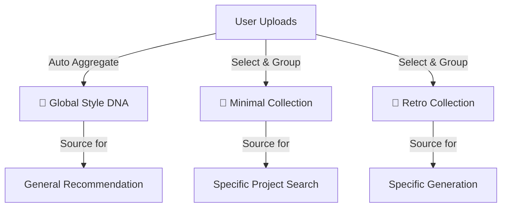

# ⚖️ Style Strategy Analysis: Global DNA vs. Curated Collections

## 1. 비교 분석 (Comparative Analysis)

제가 제안했던 **"User Style DNA"**와 디렉터님이 제안하신 **"Style Collection"**은 목표하는 바가 다르지만, 서로 완벽하게 상호보완적인 관계에 있습니다.

| 비교 항목 | 🧬 User Style DNA (기존 제안) | 📁 Style Collection (디렉터님 제안) |
| :--- | :--- | :--- |
| **핵심 철학** | **"Who I Am"** (정체성) | **"What I Want"** (의도/맥락) |
| **데이터 범위** | 유저의 **모든** 작업물 (전체 집합) | 유저가 **선별한** 작업물 (부분 집합) |
| **생성 방식** | **자동** (업로드 시 자동 누적/갱신) | **수동** (유저가 의도를 갖고 그룹핑) |
| **스타일 특성** | 여러 스타일이 섞인 **평균적** 특성 | 특정 테마가 뚜렷한 **구체적** 특성 |
| **주요 장점** | 별도 관리 없이도 내 성향 파악 가능 | 프로젝트/무드별로 정교한 제어 가능 |
| **한계점** | 스타일이 섞이면(예: 미니멀+레트로) 이도 저도 아닌 평균값이 될 수 있음 | 유저가 일일이 분류해야 하는 귀찮음 존재 |

### 🔍 차이점 핵심 요약
- **제 안**: "당신은 대체로 이런 스타일을 선호하는군요." (통계적 접근)
- **디렉터님 안**: "당신은 지금 **이런 스타일**을 참고하고 싶군요." (도구적 접근)

---

## 2. 상호보완 및 통합 전략 (Synthesis)

두 접근법을 결합하면 **"게으른 유저를 위한 자동화"**와 **"프로 유저를 위한 정교함"**을 모두 잡을 수 있습니다.

### 2.1 통합 모델: "Multi-Persona Design System"

우리는 유저를 **단 하나의 스타일**로 규정하지 않습니다. 유저는 여러 개의 **"디자인 페르소나(Collection)"**를 가질 수 있으며, **"Global DNA"**는 그 모든 페르소나의 총합(Default)이 됩니다.

### 2.2 시너지 포인트

1.  **Batch Upload (제 안) + Collection (디렉터님 안)**
    *   대량 업로드는 컬렉션을 빠르게 만들기 위한 필수 기능입니다.
    *   **UX**: "폴더째로 업로드" -> "이 작업물들로 새 컬렉션 만들기" (자연스러운 연결)

2.  **Global DNA (제 안) + Outlier Detection**
    *   전체 DNA를 분석하다 보면, 유독 튀는 그룹(Cluster)이 발견됩니다.
    *   **AI 제안**: "회원님, 최근 '사이버펑크' 스타일 작업물이 많아졌네요. 이걸로 새 컬렉션을 만들까요?" (자동화된 큐레이션)

---

## 3. 새로운 통합 구현 전략 (New Execution Plan)

### 3.1 데이터 구조 (Data Structure)

`users` 컬렉션 하위에 두 가지를 모두 둡니다.

1.  `style_profile` (Document): **Global DNA**. 모든 작업물의 이동 평균. (Default Source)
2.  `collections` (Sub-collection): **Curated DNA**. 유저가 생성한 스타일 그룹.

### 3.2 UX 플로우 혁신

#### A. 업로드 단계 (Source Ingestion)
1.  **Drag & Drop**: 폴더 또는 다수 파일 드롭.
2.  **Immediate Analysis**: 개별 파일 분석 진행.
3.  **Action Selection**:
    *   [기본] "내 전체 스타일에 반영" (Global DNA 갱신)
    *   [옵션] "**새 컬렉션으로 묶기**" (예: "2025 금융 앱 프로젝트")
    *   [옵션] "기존 컬렉션에 추가"

#### B. 서칭/생성 단계 (Source Utilization)
검색창 옆에 **"Source Selector"** 드롭다운을 배치합니다.

*   **Source: My Global DNA** (기본값)
    *   "내 평소 스타일대로 찾아줘"
*   **Source: [📁 Minimal UI Set]**
    *   "내가 모아둔 미니멀 컬렉션이랑 비슷한 걸로 찾아줘"
*   **Source: [📁 2024 Portfolio]**
    *   "내 작년 포트폴리오 톤앤매너를 유지해서 생성해줘"

### 3.3 기술적 로드맵 수정

1.  **Phase 1: Collection Foundation**
    *   `collections` CRUD API 구현.
    *   다중 업로드 후 "컬렉션 생성"으로 이어지는 UX 구현.
    *   **핵심**: 개별 분석 결과(`analyses`)들을 묶어서 `synthesizedDNA`를 계산하는 로직 구현.

2.  **Phase 2: Source-based Search**
    *   검색 엔진에 `vector` 파라미터 추가.
    *   Source Selector에서 선택된 컬렉션의 `styleVector`를 검색 쿼리로 주입.

3.  **Phase 3: AI Curation (Smart Grouping)**
    *   Global DNA 내에서 K-means Clustering을 돌려, "숨겨진 컬렉션"을 찾아내어 유저에게 제안.
    *   예: "회원님의 작업물 중 30%가 'Dark Mode'입니다. 컬렉션으로 분리할까요?"

## 4. 결론

디렉터님의 **"Collection"** 개념은 시스템을 전문가용 도구로 격상시키는 핵심 열쇠입니다. 제 기존 안은 **"배경(Background)"**에서 돌아가는 기본 엔진으로 두고, 전면에는 디렉터님의 **"Collection"**을 내세워 유저가 능동적으로 자신의 스타일을 **자산화(Assetization)** 하도록 유도하는 것이 최선입니다.
